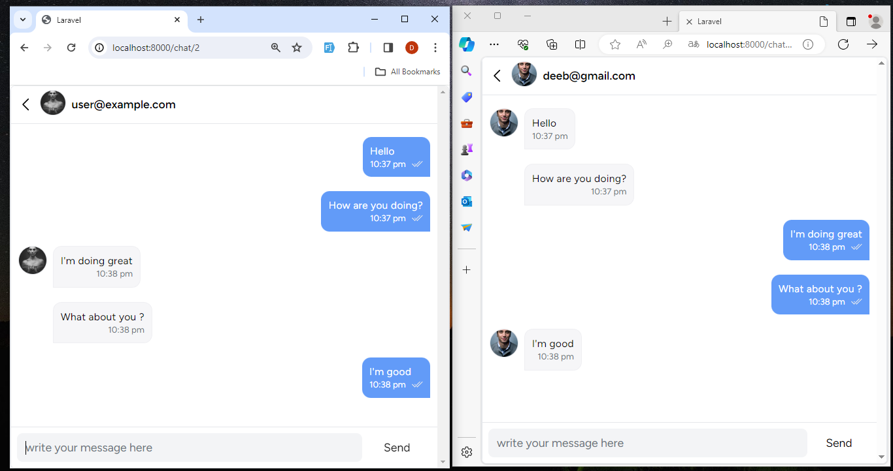

<h3>building a Chat site </h3>

I used Laravel 11 && Livewire v3 && Pusher realTime service with laravel echo 
  

Users List
  
 

Chat page
  
 

Chat page for user 1
  
 

Chat page for user 2
  
 

Chat for both of users 
  
 

